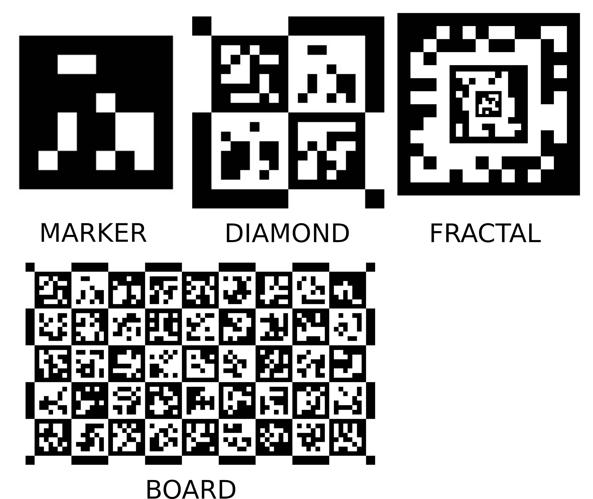

# aruco2 — A Simpler ArUco for OpenCV 



A proposed replacement for the ArUco module in OpenCV (fully compatible and compiling with both OpenCV 5 and OpenCV 4), by the original ArUco author. This repository serves as the standalone version of the implementation proposed in [OpenCV PR #29063](https://github.com/opencv/opencv/pull/29063) before it is accepted (if it ever is) in the official OpenCV.

- **Simpler API** — one function call, results in a single `vector<FiducialMarker>` (no parallel vectors)
- **Single public header** — `#include "aruco2.hpp"` is all you need; no extra headers to hunt down
- **6.5× more efficient** detection engine based on [ArUco Nano](https://www.sciencedirect.com/science/article/pii/S2352711026001822)
- **[OpenCL acceleration](#opencl--gpu-acceleration)** for markers ([SSRN 7031769](https://papers.ssrn.com/sol3/papers.cfm?abstract_id=7031769)) 
- **Fractal markers** — [nested multi-scale design](https://ieeexplore.ieee.org/document/8890613/) gives many more corners for pose estimation, robust to heavy occlusion 
- **Boards and diamonds** based on [ChArUco2](https://www.sciencedirect.com/science/article/pii/S2352711026003249) — double the marker density, twice the corners at 75% occlusion
- **RArUco markers** ([arXiv:2607.13830](https://arxiv.org/html/2607.13830v2)) — recursive design nesting the same marker ID within its own bit cells; maintains a single ID across all scales for robust, long-range UAV landing pads (independent of center visibility)
- **Up to 2.7× faster** dictionary identification via O(1) hash-map lookup

---

## Motivation

Detecting markers with the current OpenCV ArUco API looks like this:

```cpp
// Current OpenCV aruco — a lot of boilerplate for a simple task
cv::aruco::Dictionary dict = cv::aruco::getPredefinedDictionary(cv::aruco::DICT_ARUCO_MIP_36h12);
cv::aruco::DetectorParameters params;
cv::aruco::ArucoDetector detector(dict, params);

std::vector<std::vector<cv::Point2f>> corners;
std::vector<int> ids;
std::vector<std::vector<cv::Point2f>> rejected;
detector.detectMarkers(image, corners, ids, rejected);

// corners and ids are parallel vectors — easy to get out of sync
for (size_t i = 0; i < ids.size(); i++)
    std::cout << "id=" << ids[i] << " corner0=" << corners[i][0] << "\n";
```

With `aruco2` the same task is a single line:

```cpp
// aruco2 — detect and iterate
for (auto &marker : cv::aruco2::detectFiducialMarkers(image))
    std::cout << "id=" << marker.id << " corner0=" << marker.corners[0] << "\n";
```

---

## Key design changes

| | Current OpenCV aruco | aruco2 |
|---|---|---|
| Entry point | `ArucoDetector` class instance | free function `detectFiducialMarkers()` |
| Public API surface | multiple headers | single `aruco2.hpp` |
| Result type | two parallel vectors (`corners`, `ids`) | `vector<FiducialMarker>` — id and corners travel together |
| Multi-dictionary | not supported in one call | `detectFiducialMarkers(image, {DICT_A, DICT_B})` |
| Default error correction | 0.6 (may cause false positives) | 0 (strict — raise only when needed) |
| Board design | markers on half the squares | ChArUco2: markers on every square |
| Diamond | separate concept using corner lists | first-class `Diamond` type with `vector<FiducialMarker>` |
| Fractal markers | not supported | first-class `FractalMarker` type — nested design, many more pose corners |
| RArUco markers | not supported | recursive marker generation and detection via `detectRArucoMarkers()` |
| Python result | separate lists | `markers = cv.aruco2.detectFiducialMarkers(image)` |

---

## Data types

```cpp
struct FiducialMarker {
    std::vector<cv::Point2f> corners; // 4 corners, clockwise from top-left
    int id = -1;
    DictionaryType dictionary;
};

struct GridBoard {
    cv::Size gridSize;              // columns × rows
    DictionaryType dictionary;
    std::vector<FiducialMarker> markers;    // detected markers (subset when partially occluded)
};

struct Diamond {
    cv::Vec4i id;                   // ids of the 4 constituent markers (clockwise from top-left)
    DictionaryType dictionary;
    std::vector<FiducialMarker> markers;    // the 4 detected markers forming the diamond
};

struct FractalMarker {
    std::vector<cv::Point2f> corners; // 4 outer corners, clockwise from top-left
    FractalType type;                 // fractal configuration (FRACTAL_2L_6 … FRACTAL_5L_6)
    int id = -1;                      // id of the outer marker
};
```

---

## API

| Function | Description |
|---|---|
| `getFiducialMarkerImage(img, dictionary, id)` | render a single marker to an image |
| `getGridBoardImage(img, boardSize, dictionary)` | render a grid board to an image |
| `getDiamondImage(img, dictionary, ids)` | render a diamond (2×2 block) to an image |
| `getFractalMarkerImage(img, ftype)` | render a fractal marker to an image |
| `getRArucoMarkerImage(img, dictionary, id, depth, bitSize, innerBorders, externalBorder)` | render a RArUco marker to an image |
| `detectFiducialMarkers(image, dictionary)` → `vector<FiducialMarker>` | find markers in an image |
| `detectFiducialMarkers(image, {dictionary, …})` → `vector<FiducialMarker>` | find markers across multiple dictionaries |
| `detectGridBoard(image, gridSize, dictionary, board)` → `bool` | find a grid board |
| `detectDiamonds(image, dictionary)` → `vector<Diamond>` | find diamond markers |
| `detectFractals(image, ftype)` → `vector<FractalMarker>` | find fractal markers |
| `detectRArucoMarkers(image, dictionary, params)` → `vector<FiducialMarker>` | find RArUco markers (ignores center details using border-sampling) |
| `drawFiducialMarkers(image, markers)` | draw marker outlines and ids |
| `drawGridBoard(image, board)` | draw detected board corners |
| `drawDiamonds(image, diamonds)` | draw diamond outlines and ids |
| `drawFractals(image, fractals)` | draw fractal marker outlines, ids, and all matched image points (circles) |
| `drawAxis(image, cameraMatrix, distCoeffs, rvec, tvec, length)` | draw XYZ coordinate axes from a solvePnP result (X red, Y green, Z blue) |
| `getSolvePnpPoints(marker, objPts, imgPts)` | extract solvePnP inputs for a fiducial marker |
| `getSolvePnpPoints(board, objPts, imgPts)` | extract solvePnP inputs for a grid board |
| `getSolvePnpPoints(diamond, objPts, imgPts)` | extract solvePnP inputs for a diamond |
| `getSolvePnpPoints(fractal, objPts, imgPts)` | extract solvePnP inputs for a fractal marker |

Generate → Detect → Draw → Pose: four verbs, four target types, one consistent pattern.

---

## Examples

### Detect markers (single dictionary)

```cpp
#include "aruco2.hpp"

cv::Mat image = cv::imread("scene.jpg");

auto markers = cv::aruco2::detectFiducialMarkers(image);  // default: DICT_ARUCO_MIP_36h12

for (const auto &m : markers)
    std::cout << "id=" << m.id << " corner0=" << m.corners[0] << "\n";
```

Pass a different dictionary as the second argument:

```cpp
auto markers = cv::aruco2::detectFiducialMarkers(image, cv::aruco2::DICT_6X6_250);
```

---

### Detect markers across multiple dictionaries

```cpp
using namespace cv::aruco2;

auto markers = detectFiducialMarkers(image, {DICT_6X6_250, DICT_APRILTAG_36h11});

for (const auto &m : markers) {
    std::string dictName = (m.dictionary == DICT_6X6_250) ? "aruco" : "apriltag";
    std::cout << dictName << " id=" << m.id << "\n";
}
```

Each candidate is matched against all dictionaries in a single pass and carries the dictionary it was found in.

---

### Draw detected markers

```cpp
auto markers = cv::aruco2::detectFiducialMarkers(image);
cv::aruco2::drawFiducialMarkers(image, markers);                          // green border
cv::aruco2::drawFiducialMarkers(image, markers, cv::Scalar(255, 0, 0));   // blue border
cv::imshow("markers", image);
```

Each marker is drawn with a coloured outline, the id at its centre, and a dot on `corners[0]` to show orientation.

---

### Generate a marker image

```cpp
cv::Mat markerImg;
cv::aruco2::getFiducialMarkerImage(markerImg, cv::aruco2::DICT_6X6_250, 42);
cv::imwrite("marker_42.png", markerImg);
```

The optional fourth argument controls bit size in pixels (default 20). A white outer border is added by default (`externalBorder=true`).

---

### Generate a diamond image

```cpp
cv::Mat diamondImg;
cv::aruco2::getDiamondImage(diamondImg, cv::aruco2::DICT_6X6_250, {10, 11, 12, 13});
cv::imwrite("diamond.png", diamondImg);
```

The four ids are arranged clockwise from the top-left, matching the `Diamond::id` field
returned by `detectDiamonds()`.

---

### Pose estimation from a single marker

`getSolvePnpPoints` takes an optional `markerSize` parameter (physical side length, e.g. in metres).
Pass it directly — no manual scaling needed:

```cpp
cv::Mat cameraMatrix, distCoeffs; // from calibration

for (const auto &m : cv::aruco2::detectFiducialMarkers(image)) {
    cv::Mat imgPts, objPts, rvec, tvec;
    cv::aruco2::getSolvePnpPoints(m, objPts, imgPts, 0.05f); // 5 cm marker
    cv::solvePnP(objPts, imgPts, cameraMatrix, distCoeffs, rvec, tvec);

    // Draw XYZ axes at the marker origin (X red, Y green, Z blue toward camera)
    cv::aruco2::drawAxis(image, cameraMatrix, distCoeffs, rvec, tvec, 0.025f);
}
```

---

### Drawing coordinate axes

`drawAxis` visualises the pose returned by `solvePnP` as three coloured segments drawn from
the marker's origin: **X red**, **Y green**, **Z blue** (toward the camera).

```cpp
cv::Mat rvec, tvec; // from solvePnP
cv::aruco2::drawAxis(image, cameraMatrix, distCoeffs, rvec, tvec,
                     0.025f); // axis length in the same unit as tvec (here 2.5 cm)
```

The function works identically for markers, boards, diamonds and fractal markers — pass the
`rvec` / `tvec` pair from any `solvePnP` call.

Coordinate conventions (all target types share the same handedness):

| Target | Origin | X | Y | Z |
|---|---|---|---|---|
| FiducialMarker | marker centre | → right | ↑ up | out of plane toward camera |
| GridBoard | top-left corner | → right | ↑ up | out of plane toward camera |
| Diamond | diamond centre | → right | ↑ up | out of plane toward camera |
| Fractal | marker centre | → right | ↑ up | out of plane toward camera |

---

### Board generation and detection

Grid boards follow the [ChArUco2](https://www.sciencedirect.com/science/article/pii/S2352711026003249) design: every square carries a marker — standard markers on black squares and inverted markers on white squares — doubling the marker density compared to standard ChArUco.

> [!TIP]
> A pre-generated board image is provided in the repository root as [board9x5.png](board9x5.png) (`DICT_ARUCO_MIP_36h12`, 9×5 grid). You can print or use this file directly for testing without having to generate it yourself.

```cpp
// Generate a 4×3 board image
cv::Mat boardImg;
cv::aruco2::getGridBoardImage(boardImg, cv::Size(4, 3), cv::aruco2::DICT_6X6_250);
cv::imwrite("board.png", boardImg);

// Detect the board
cv::aruco2::GridBoard board;
bool found = cv::aruco2::detectGridBoard(image, cv::Size(4, 3),
                                     cv::aruco2::DICT_6X6_250, board);
if (found) {
    std::cout << "Detected " << board.markers.size() << " of 12 markers\n";

    // Draw detected corners
    cv::aruco2::drawGridBoard(image, board);

    // Pose estimation — uses all detected board corners, robust to partial occlusion
    cv::Mat imgPts, objPts, rvec, tvec;
    cv::aruco2::getSolvePnpPoints(board, objPts, imgPts, 0.05f); // 5 cm markers
    cv::solvePnP(objPts, imgPts, cameraMatrix, distCoeffs, rvec, tvec);
}
```

In Python:

```python
found, board = cv.aruco2.detectGridBoard(image, (4, 3), cv.aruco2.DICT_6X6_250)
```

---

### Diamond detection and pose estimation

A diamond is a 2×2 block of markers.  Its identity is the combination of the four constituent marker ids, stored as a `Vec4i`.  `getSolvePnpPoints` returns the full 9-point 3×3 corner grid of the diamond.

```cpp
auto diamonds = cv::aruco2::detectDiamonds(image, cv::aruco2::DICT_6X6_250);

// Draw detected diamonds
cv::aruco2::drawDiamonds(image, diamonds);

for (const auto &d : diamonds) {
    std::cout << "Diamond ids: "
              << d.id[0] << " " << d.id[1] << " "
              << d.id[2] << " " << d.id[3] << "\n";

    // imgPts and objPts are 9×1 (full 3×3 corner grid)
    cv::Mat imgPts, objPts, rvec, tvec;
    cv::aruco2::getSolvePnpPoints(d, objPts, imgPts, 0.05f); // 5 cm markers
    cv::solvePnP(objPts, imgPts, cameraMatrix, distCoeffs, rvec, tvec);
}
```

---

### Tuning detection

The defaults are intentionally strict to avoid false positives.  Relax them only as needed:

```cpp
cv::aruco2::DetectorParameters params;
params.errorCorrectionRate         = 0.5;  // tolerate some bit errors
params.maxErroneousBitsInBorderRate = 0.05; // tolerate slight border damage
params.detectInvertedMarker        = true;  // white markers on black background

auto markers = cv::aruco2::detectFiducialMarkers(image, cv::aruco2::DICT_6X6_250, params);
```

---

### Fractal marker generation and detection

A fractal marker is a nested design: the outer 6×6 marker contains one or more smaller
markers at decreasing scales.  More levels mean more visible corners, giving better pose
accuracy and robustness to partial occlusion.

```cpp
// Generate a FRACTAL_3L_6 image (3 nesting levels)
cv::Mat fractalImg;
cv::aruco2::getFractalMarkerImage(fractalImg, cv::aruco2::FRACTAL_3L_6);
cv::imwrite("fractal.png", fractalImg);

// Detect fractal markers
auto fractals = cv::aruco2::detectFractals(image, cv::aruco2::FRACTAL_3L_6);

// Draw results — outline, id, and all matched image points (default)
cv::aruco2::drawFractals(image, fractals);

// Outline and id only, no image points
// cv::aruco2::drawFractals(image, fractals, cv::Scalar(0,255,0), false);

for (const auto &f : fractals)
    std::cout << "id=" << f.id << " corner0=" << f.corners[0] << "\n";
```

### Fractal marker pose estimation

Use `getSolvePnpPoints` to obtain all inner and outer
corners — far more correspondences than a plain marker provides:

```cpp
cv::Mat cameraMatrix, distCoeffs; // from calibration

auto fractals = cv::aruco2::detectFractals(image, cv::aruco2::FRACTAL_3L_6);

for (const auto &f : fractals) {
    cv::Mat imgPts, objPts, rvec, tvec;
    cv::aruco2::getSolvePnpPoints(f, objPts, imgPts, 0.10f); // 10 cm outer marker
    cv::solvePnP(objPts, imgPts, cameraMatrix, distCoeffs, rvec, tvec);
}

```

### RArUco marker generation and detection

RArUco markers are recursively nested fiducial markers designed specifically for applications with highly dynamic camera-to-target distances, such as Unmanned Aerial Vehicle (UAV) landing pads. The exact same marker ID is embedded at all levels of recursion, allowing a unified identity across scales.

#### Generate a RArUco marker

```cpp
#include "opencv2/objdetect/aruco2.hpp"

cv::Mat rarucoImg;
// Generate a RArUco marker using DICT_APRILTAG_16h5, ID 0, recursion depth 2
cv::aruco2::getRArucoMarkerImage(rarucoImg, cv::aruco2::DICT_APRILTAG_16h5, 0, 2, 30, 2, true);
cv::imwrite("raruco_marker.png", rarucoImg);
```

#### Detect RArUco markers

The detection algorithm uses a border-sampling strategy to read bit colors only from the borders of the bits, explicitly ignoring their centers. This makes RArUco markers highly robust to occlusion or inner sub-marker structure.

```cpp
#include "opencv2/objdetect/aruco2.hpp"
#include <iostream>

cv::Mat image = cv::imread("scene.jpg");

// Detect RArUco markers (automatically configures grid bit-sampling and dual color mode)
auto markers = cv::aruco2::detectRArucoMarkers(image, cv::aruco2::DICT_APRILTAG_16h5);

for (const auto &m : markers) {
    std::cout << "Detected RArUco marker ID=" << m.id << "\n";
    
    // Perform pose estimation using the standard solvePnP points helper
    cv::Mat imgPts, objPts, rvec, tvec;
    // Pass the estimated physical size of this specific marker level (e.g. 30 cm)
    cv::aruco2::getSolvePnpPoints(m, objPts, imgPts, 0.30f);
    // cv::solvePnP(objPts, imgPts, cameraMatrix, distCoeffs, rvec, tvec);
}
```

### OpenCL / GPU Acceleration

`aruco2` features a high-performance, fully GPU-accelerated detection pipeline using OpenCL. Key stages—including image thresholding, connected component labeling, corner extraction, candidate identification, and subpixel corner refinement—are run entirely on the GPU.

#### How to use it
To trigger GPU acceleration, simply pass the input image as a `cv::UMat` instead of `cv::Mat`. The library detects the input type and automatically routes it to the OpenCL pipeline.

```cpp
#include "aruco2.hpp"
#include <opencv2/core/ocl.hpp>
#include <iostream>

// Verify OpenCL is available and enabled
cv::ocl::setUseOpenCL(true); // Optional: explicitly enable

if (cv::ocl::useOpenCL()) {
    cv::Mat gray = cv::imread("scene.jpg", cv::IMREAD_GRAYSCALE);
    
    // Transfer CPU image data to GPU memory (UMat)
    cv::UMat u_gray;
    gray.copyTo(u_gray);

    // Runs the entire detection pipeline on the GPU
    auto markers = cv::aruco2::detectFiducialMarkers(u_gray);

    for (const auto &m : markers) {
        std::cout << "GPU Detected ID: " << m.id << "\n";
    }
} else {
    std::cout << "OpenCL is not available. Falling back to CPU.\n";
}
```

#### Selecting a Specific Device
OpenCV dynamically compiles the OpenCL kernels (`opencl/arucodetect.cl`) at runtime. You can specify which OpenCL device to run on (e.g., a discrete GPU vs. an integrated GPU) by setting the `OPENCV_OPENCL_DEVICE` environment variable before running your application.

For example:
```bash
# Run on the first GPU device
export OPENCV_OPENCL_DEVICE=:GPU:0

# Run on an AMD platform
export OPENCV_OPENCL_DEVICE=AMD
```

---

## Implementation

### Marker detection — based on ArUco Nano

The marker detector is based on [ArUco Nano](https://www.sciencedirect.com/science/article/pii/S2352711026001822), a
high-performance single-header detector described in:

> R. Muñoz-Salinas et al., *"ArUco Nano: a simpler, faster, and more reliable fiducial marker
> detector"*, SoftwareX, 2026.

Key advantages over the standard OpenCV ArUco detector:

- **Up to 6.5× faster** than OpenCV ArUco single-threaded, **2× faster** than its
  multi-threaded mode (benchmarked on Intel Core i7-13700H)

| Resolution | aruco2 | OpenCV ArUco | Speedup |
|---|---|---|---|
| 1 MP  |   6.68 ms |  43.46 ms | 6.5× |
| 4 MP  |  22.93 ms | 125.00 ms | 5.4× |
| 16 MP | 101.67 ms | 504.27 ms | 4.9× |

- **Visited-aware contour tracer** — prunes revisited pixels to suppress noise and thin
  structures, reducing false candidates before any dictionary lookup
- **SIMD-accelerated** via OpenCV universal intrinsics
- **Multi-attempt corner perturbation** — slightly jitters corners on retry attempts to
  improve robustness under perspective distortion
- **O(1) Dictionary Lookup** — exact matches in `Dictionary::identify` use a pre-computed hash map, making identification time independent of dictionary size.

| Dictionary | Mode | Official OpenCV | aruco2 (Optimized) | Speedup |
|---|---|---|---|---|
| **DICT_6X6_250** | Exact | 0.65 µs | 0.27 µs | **2.4×** |
| | Correction | 0.63 µs | 0.25 µs | **2.5×** |
| **DICT_APRILTAG_36h10** | Exact | 0.64 µs | 0.25 µs | **2.6×** |
| | Correction | 0.64 µs | 0.24 µs | **2.7×** |

*(Benchmarked on Intel Core i7-13700H, average identification time per marker candidate)*

---

### Boards and diamonds — based on ChArUco2

The board and diamond design is based on [ChArUco2](https://www.sciencedirect.com/science/article/pii/S2352711026003249)

Key advantages over standard OpenCV ChArUco:

- **Double marker density** — every square carries a marker (standard on black, inverted on
  white) versus ~half the squares in standard ChArUco
- **Larger markers** — each occupies the full square area with no white border, improving
  detection range under challenging lighting
- **More reference corners** — (N+1)×(M+1) observable corners including the board border,
  versus (N−1)×(M−1) inner corners in standard ChArUco
- **Better diamond** — the 2×2 marker block provides more observations and a larger geometric
  baseline than the standard 4-corner diamond

| Occlusion | ChArUco corners | ChArUco2 corners |
|---|---|---|
| 0%  | 32 |  60 |
| 25% | 24 |  48 |
| 50% | 16 |  36 |
| 75% |  4 |  12 |

*(9×5 board, 26 mm squares, DICT_ARUCO_MIP_36h12)*

---

### Recursive ArUco (RArUco) markers

RArUco markers are described in:
> R. Muñoz-Salinas et al., *"Recursive ArUco Markers: A Scalable Fiducial Marker Design for Unmanned Aerial Vehicle Landing Pads"*, [arXiv:2607.13830](https://arxiv.org/abs/2607.13830), 2026.

Key features and implementation details:
- **Unified ID across scales** — embedding the same marker ID at all levels of recursion ensures that a UAV drone can unambiguously identify and land on its designated landing pad, regardless of altitude/zoom.
- **Center-occlusion robustness** — unlike standard, Fractal, or Embedded ArUco markers, RArUco does not depend on the marker's center. Instead, a modified bit-sampling strategy reads bit values from a border region of width `b`, ignoring the center where nested sub-markers reside.
- **Double color mode detection** — markers are embedded within both black and white bits. Embedded markers in black bits are color-inverted, requiring the detector to look for both standard and inverted candidates.
- **Highly efficient** — runs at ~185 FPS (tested on Intel Core i7-13700H), outperforming both standard ArUco (~85 FPS) and Fractal markers (~76 FPS).
- **Graceful degradation** — maintains a 100% detection rate at up to 30% occlusion and when cropped up to 60% (only 40% area visible).

---

## Building

This project compiles with both **OpenCV 5** and **OpenCV 4**.

```bash
cmake -B build -DCMAKE_BUILD_TYPE=Release
cmake --build build
```

---

## Status

| Feature | Status |
|---|---|
| Fiducial marker detection | done |
| Multi-dictionary detection | done |
| Draw detected fiducial markers | done |
| Generate fiducial marker images | done |
| Generate grid board images | done |
| Generate diamond images | done |
| Grid board detection | done |
| Draw detected grid board | done |
| Diamond detection | done |
| Draw detected diamonds | done |
| Pose estimation — single marker | done |
| Pose estimation — board | done |
| Pose estimation — diamond | done |
| Draw coordinate axes (`drawAxis`) | done |
| Generate fractal marker images | done |
| Fractal marker detection | done |
| Draw detected fractal markers | done |
| Pose estimation — fractal marker | done |
| Generate RArUco marker images | done |
| RArUco marker detection | done |
| OpenCL GPU acceleration | done |
| Python bindings | designed, pending OpenCV integration |

---

## License

Apache 2.0 — see [LICENSE](LICENSE).
